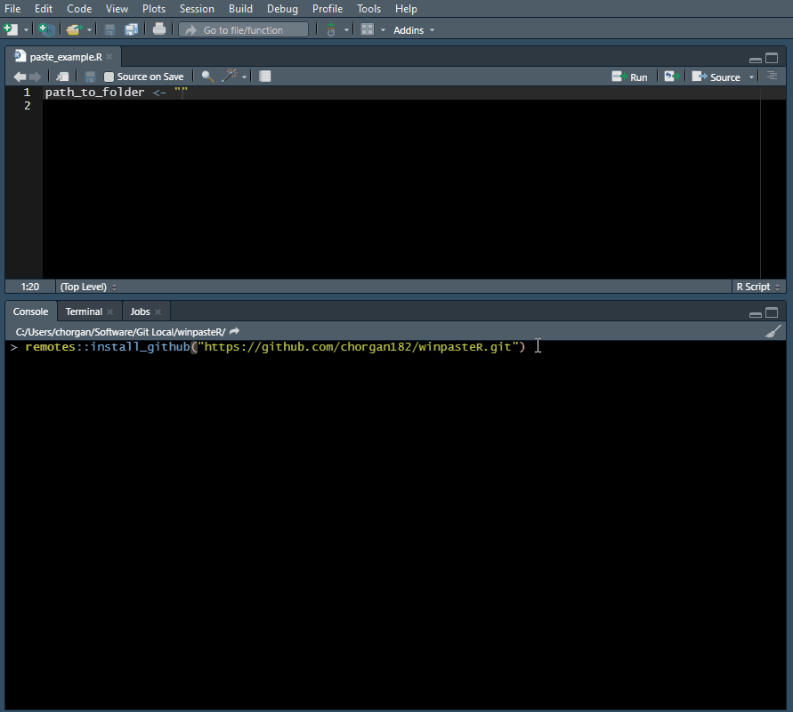

# winpasteR
RStudio Addin that makes it easy to paste Windows file paths copied from the file explorer.

Replaces the backslashes in Windows paths with forward slashes that are used in R paths.

Install with `remotes::install_github("https://github.com/chorgan182/winpasteR.git")`

Set the keyboard shortcut in RStudio by going to **Tools > Modify Keyboard Shortcuts...** and filtering on the word "paste". Assign your desired keyboard shortcut by clicking into the row that says "Paste Windows Path". `Ctrl + Shift + V` is convenient because it is familiar, but not reserved elsewhere in RStudio.

## Demo - Install and Assign Keyboard Shortcut

